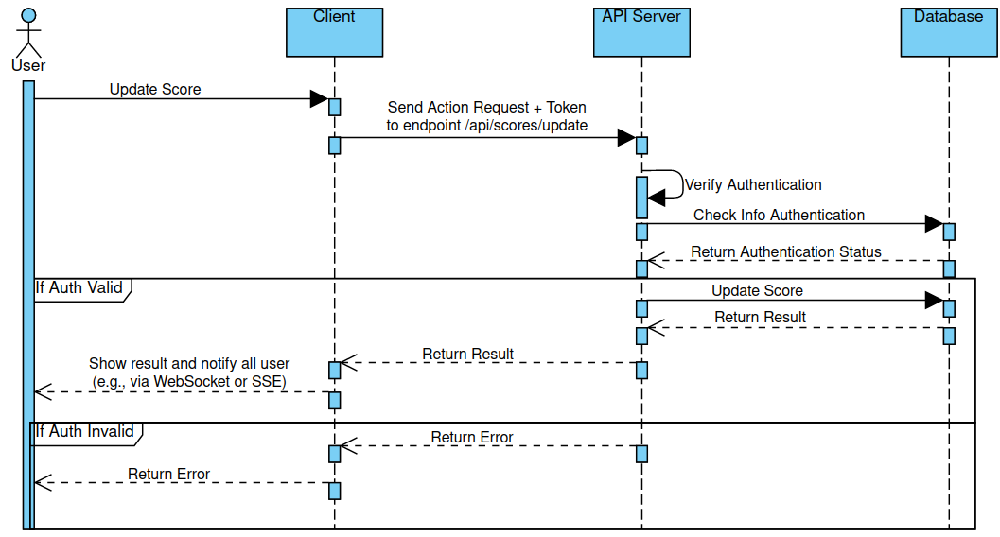

## Specification for Scoreboard API Module

### Module Overview

This module is designed to handle the backend API services for a live scoreboard that displays the top 10 users' scores. The main functionality includes updating user scores, ensuring real-time updates on the scoreboard, and preventing unauthorized score manipulation.

### Requirements

1. Live Scoreboard Update

- Display the top 10 users' score on the website.
- Ensure the scoreboard updates in real-time as users perform actions that increase their scores.

2. User Score Update

- Allow users to increase their score by complete specific actions.
- Action are completed via API calls to the backend server.

3. Security

- Implement measure to prevent unauthorized score modification
- Ensure that only legitimate actions result in score changes.

### API Endpoints

1. Get top 10 scores

- Endpoint: `/api/scores/top`
- Method: GET
- Description: Retrieve the top 10 user scores
- Response Example:

```
{
  "scores": [
    {"username": "user1", "score": 1000},
    {"username": "user2", "score": 950},
    ...
    {"username": "user10", "score": 800}
  ]
}
```

2. Update User Score

- Endpoint: `/api/scores`
- Method: PUT
- Description: Updates the score of a user based on an action performed.
- Request Body Example:

```
  {
    "userId": "USER_1234",
    "codeChallengeId": "Code_1111"
  }
```

- Response Example:

```
  {
    status: "success",
    "newScore": 1000
  }
```

### Sequence Diagram



### Additional Comments for Improvement

- Rate Limiting: Implement rate limiting on the /api/scores (Update) endpoint to prevent abuse.
- Caching: Utilize caching for the top scores endpoint to improve performance.
- Audit Logs: Maintain audit logs of score updates for security and debugging purposes.
- Testing: Ensure thorough unit and integration testing for all endpoints.
